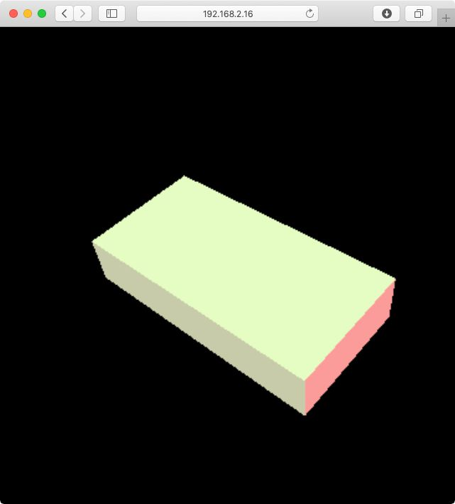

# M P U 9 2 5 0    on    E S P 3 2

Measure the orientation of a MPU9250 IMU and display the results on a web page served by an ESP32.

The project must be compiled with *PlarformIO Core 4.0*.

You have to create manually a file called `src/WifiSettings.h` with the following content:

    #pragma once
    const char *ssid        = "...";
    const char *password    = "...";
    const char *ap_ssid     = "ESP32-IMU-";
    const char *ap_password = "";

The web files must be uploaded on the ESP32 with the following command:

    platformio run --target uploadfs

## Credits

The MPU9250 driver comes from the M5Stack project:

<https://github.com/m5stack/M5Stack/blob/master/src/utility/MPU9250.cpp>

The *threejs* stuff comes from this project:

<https://github.com/DominikN/ESP32-MPU9250-web-view>
