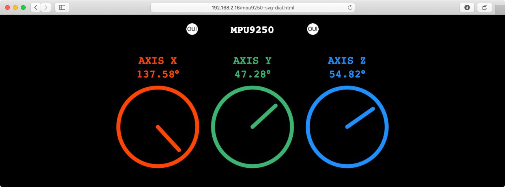
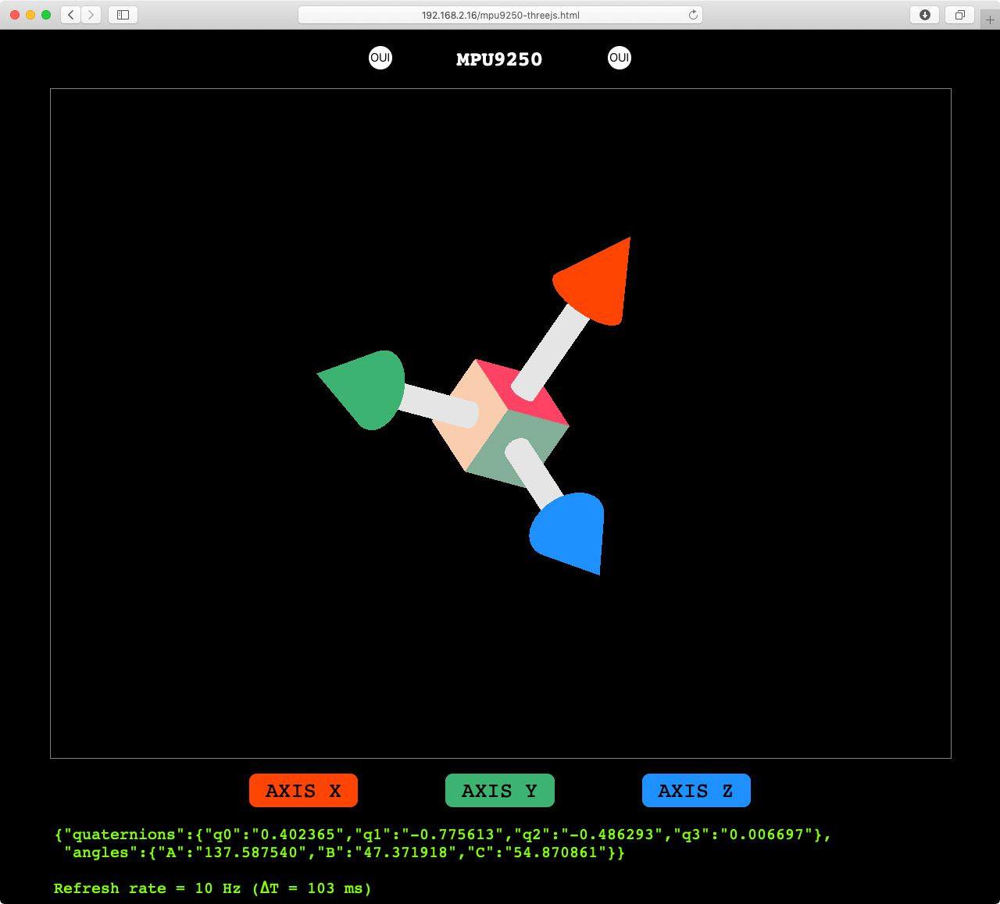

# M P U 9 2 5 0    on    E S P 3 2

Measure the orientation of a MPU9250 IMU and display the results on a web page served by an ESP32.

The project must be compiled with *PlarformIO Core 4.0*.

You have to create manually a file called `src/WifiSettings.h` with the following content:

    #pragma once
    const char *ssid        = "...";
    const char *password    = "...";
    const char *ap_ssid     = "ESP32-IMU-";
    const char *ap_password = "";

The web files must be uploaded on the ESP32 with the following command:

    platformio run --target uploadfs

## LIBRARY USED

I used the following library <https://github.com/sparkfun/SparkFun_MPU-9250-DMP_Arduino_Library>. Unfortunately, it cannot be used directly because the definition of `min()` and `max()` functions are missing so I put a copy of this library in the `lib` directory and I added the missing definition at line 97 in `inv_mpu.c`:

    #ifndef min
    #define min(X,Y) (((X) < (Y)) ? (X) : (Y))
    #endif
    #ifndef max
    #define max(X,Y) (((X) > (Y)) ? (X) : (Y))
    #endif

> Note that this lib is available twice in the PlatformIO registry ([lib 944](https://platformio.org/lib/show/944/SparkFun%20MPU-9250%20Digital%20Motion%20Processing%20(DMP)) and [lib 5399](https://platformio.org/lib/show/5399/SparkFun%20MPU-9250%20Digital%20Motion%20Processing%20(DMP))). Both of them are missing the definition of `min()` and `max()`.

## CREDITS

The *threejs* stuff comes from this project:

<https://github.com/DominikN/ESP32-MPU9250-web-view>

## FURTHER READING

 - [Euler.setFromQuaternion() produces incorrect results for <0.1% of possible quaternions.](https://github.com/mrdoob/three.js/issues/5659)
 - <https://en.wikipedia.org/wiki/Gimbal_lock>
 - <https://fr.wikipedia.org/wiki/Quaternions_et_rotation_dans_l%27espace#Comparaisons_de_performances_avec_d'autres_méthodes_de_rotation>
