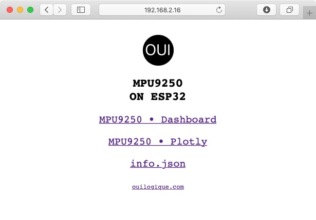

# M P U 9 2 5 0    on    E S P 3 2

Measure the orientation of a MPU9250 IMU and display the results on a web page served by an ESP32. Communication is done with WebSocket. The 3D visualisation is made with [three.js](https://threejs.org), and the 2D dials are handmade in SVG.

The project must be compiled with *PlatformIO Core 4.0*.

## INSTRUCTIONS

1. Make sure you have the latest PlatformIO revision (PlatformIO Core 4.0 at this time):

```bash
platformio upgrade
```

2. Connect the MPU9250 to the I²C port of the ESP32. Note that this step is not necessary for the M5Stack because it includes an MPU9250.

3. Create manually a file called `src/WifiSettings.h` with the following content:

```cpp
#pragma once
const char *ssid        = "..."; // SSID of your WiFi router.
const char *password    = "..."; // Pasword  of your WiFi router.
const char *ap_ssid     = "ESP32-IMU-"; // Name of the ESP in soft-AP mode.
const char *ap_password = ""; // let blank
```

4. Update the file `platformio.ini`. For most of the ESP32 models, the variable `default_envs` must be set to `esp32doit-devkit-v1`. If you have a *M5Stack*, you can set it to `m5stack-core-esp32`. In case of problem, you will need to add your own board model.

5. Upload the web files on the ESP32 with the following command:

```bash
platformio run --target uploadfs
```

6. Upload the code to the ESP32 with PlatformIO.

7. Check the IP addresses in the serial output. You may need to reboot your ESP to see them.
    - Use `STATION IP address` to connect to your ESP32 via your WiFi router.
    - Use `SOFT-AP IP address` to connect your computer directly to your ESP32.

8. Navigate to the IP address of the ESP32 in your web browser. You should see the pages below. You can open all of them in separate windows at the same time.

<p align="center">



</p>

## LIMITATIONS

### Communication lag

The communication is sometimes frozen from a few hundred milliseconds up to several seconds. This is probably due to WiFi performance. I performed a test where JSON data is sent via the serial port to a Python script that transmits it via WebSocket to the web page (the Python script and web page run on the same computer). In this setup the communication does not freeze anymore, but the serial communication has a longer response time, i.e. the movements are reflected on the screen with a small delay that is noticeable.

### Gimbal lock

The calculation of Euler angles has a Gimbal lock problem. If you want to see it:

- Open the dashboard web page.
- Find the orientation of the MPU9250 that makes all 3 dials vertical (at 12 o’clock).
- Rotate the MPU only around X and then only around Z and check the output in both *threejs* and *dials* windows. They should show consistent results.
- Rotate the MPU around Y only and you’ll see that the results are OK in *threejs* but not in *dials*. This is because *threejs* uses quaternions and *dials* uses Euler angles.


## LIBRARY USED

I used the following library <https://github.com/sparkfun/SparkFun_MPU-9250-DMP_Arduino_Library>. Unfortunately, it cannot be used directly because the definition of `min()` and `max()` functions are missing so I put a copy of this library in the `lib` directory and I added the missing definition at line 97 in `inv_mpu.c`:

```cpp
#ifndef min
#define min(X,Y) (((X) < (Y)) ? (X) : (Y))
#endif
#ifndef max
#define max(X,Y) (((X) > (Y)) ? (X) : (Y))
#endif
```

> Note that this lib is available twice in the PlatformIO registry ([lib 944](https://platformio.org/lib/show/944/SparkFun%20MPU-9250%20Digital%20Motion%20Processing%20(DMP)) and [lib 5399](https://platformio.org/lib/show/5399/SparkFun%20MPU-9250%20Digital%20Motion%20Processing%20(DMP))). Both of them are missing the definition of `min()` and `max()`.


## CREDITS

The *threejs* stuff comes from this project:

<https://github.com/DominikN/ESP32-MPU9250-web-view>


## FURTHER READING

 - [Euler.setFromQuaternion() produces incorrect results for <0.1% of possible quaternions.](https://github.com/mrdoob/three.js/issues/5659)
 - <https://en.wikipedia.org/wiki/Gimbal_lock>
 - <https://fr.wikipedia.org/wiki/Quaternions_et_rotation_dans_l%27espace#Comparaisons_de_performances_avec_d'autres_méthodes_de_rotation>
